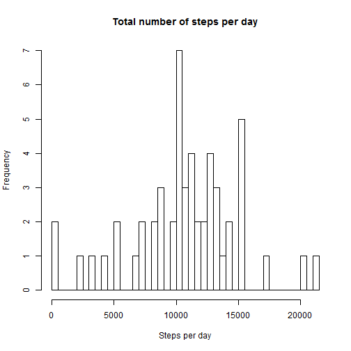
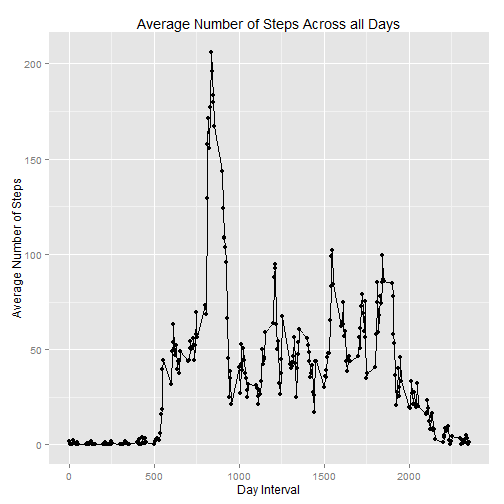
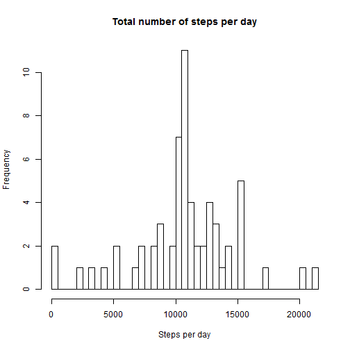
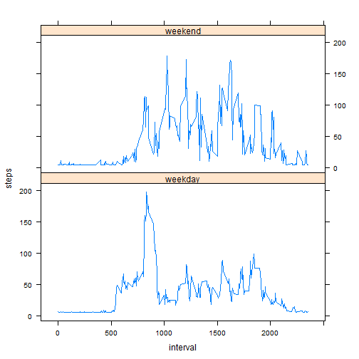

# Reproducible Research: Peer Assessment 1

## Loading and preprocessing the data

```r
unzip("activity.zip")
activity <- read.csv("activity.csv", header = TRUE)
head(activity)
```

```
##   steps       date interval
## 1    NA 2012-10-01        0
## 2    NA 2012-10-01        5
## 3    NA 2012-10-01       10
## 4    NA 2012-10-01       15
## 5    NA 2012-10-01       20
## 6    NA 2012-10-01       25
```

```r
activity.full=activity[!is.na(activity$steps),]
```

## What is mean total number of steps taken per day?
###Making a histogram of the total number of steps taken each day

```r
aggregate.date <- aggregate(activity.full$steps,
                            by=list(activity.full$date),FUN=sum)
hist(aggregate.date$x, breaks = 35, xlab="Steps per day",
     main="Total number of steps per day")
```

 

###Calculating the mean and median total number of steps taken per day


```r
mean.steps <- mean(aggregate.date$x)
median.steps <- median(aggregate.date$x)
```
The mean total number of steps taken per day is 1.0766 &times; 10<sup>4</sup> 
and the median is 10765.

## What is the average daily activity pattern?
###Making a time series plot of the 5-minute interval (x-axis) and the average number of steps taken, averaged across all days (y-axis) using ggplot

```r
aggregate.interval <- aggregate(activity.full$steps,
                                by=list(activity.full$interval),FUN=mean)
library(ggplot2)
gplot <- ggplot(aggregate.interval, aes(aggregate.interval$Group.1,
                               aggregate.interval$x)) 
gplot <- gplot +geom_point()+geom_line() 
gplot +labs(title="Average Number of Steps Across all Days",
             x="Day Interval", y="Average Number of Steps")
```

 

```r
maxint <- aggregate.interval$Group.1[aggregate.interval$x==max(aggregate.interval$x)]
```
Which 5-minute interval, on average across all the days in the dataset, contains the maximum number of steps?

The maximum number of steps (206.1698) contains the 835th interval


## Imputing missing values
###Calculating the total number of missing values in the dataset (i.e. the total number of rows with NAs)

```r
nas <- sum(is.na(activity$steps))
```
Dataset contains 2304 missing values.

### Filling in all of the missing values in the dataset using the mean value.

```r
steps2 <- activity$steps
steps2[is.na(steps2)] <- mean(activity$steps, na.rm = TRUE)
```

###Creating a new dataset that is equal to the original dataset but with the missing data filled in.

```r
activity.without.nas = data.frame(steps = steps2, 
                                  date = activity$date, 
                                  interval = activity$interval)
head(activity.without.nas)
```

```
##   steps       date interval
## 1 37.38 2012-10-01        0
## 2 37.38 2012-10-01        5
## 3 37.38 2012-10-01       10
## 4 37.38 2012-10-01       15
## 5 37.38 2012-10-01       20
## 6 37.38 2012-10-01       25
```

###Making a histogram of the total number of steps taken each day after imputation

```r
aggregate.date2 <- aggregate(activity.without.nas$steps,
                            by=list(activity.without.nas$date),FUN=sum)
hist(aggregate.date2$x, breaks = 35, xlab="Steps per day",
     main="Total number of steps per day")
```

 

###Calculating the mean and median total number of steps taken per day after imputation


```r
mean.steps2 <- mean(aggregate.date2$x)
median.steps2 <- median(aggregate.date2$x)
```
The mean total number of steps taken per day is 1.0766 &times; 10<sup>4</sup> 
and the median is 1.0766 &times; 10<sup>4</sup>. Mean and median remain about the same.
Median became differ, but the impact is not very significant.

## Are there differences in activity patterns between weekdays and weekends?
###Creating a new factor variable in the dataset with two levels - “weekday” and “weekend” indicating whether a given date is a weekday or weekend day.


```r
activity.without.nas$Days <- ifelse(weekdays(as.Date(activity.without.nas$date)) 
                  %in% c("Ñóááîòà", "âîñêðåñåíüå"), "weekend", "weekday")

head(activity.without.nas)
```

```
##   steps       date interval    Days
## 1 37.38 2012-10-01        0 weekday
## 2 37.38 2012-10-01        5 weekday
## 3 37.38 2012-10-01       10 weekday
## 4 37.38 2012-10-01       15 weekday
## 5 37.38 2012-10-01       20 weekday
## 6 37.38 2012-10-01       25 weekday
```

###Making a time series plot of the 5-minute interval (x-axis) and the average number of steps taken, averaged across all days (y-axis) using plyr and lattice

```r
library(plyr)
averagenew <- ddply(activity.without.nas, .(interval, Days), summarize, 
                    steps = mean(steps, na.rm = TRUE))
library(lattice)
xyplot(steps ~ interval | Days, data = averagenew, type = "l", layout = c(1,2))
```

 
